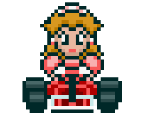

<h1>Mario Kart Node.JS</h1>

<table>
  <tr>
    <td>
      
    </td>
    <td>
      <b>Objetivo:</b>
      
Este projeto simula corridas entre personagens do universo Mario Kart, utilizando atributos como velocidade, manobrabilidade e poder. O jogo é executado via terminal e permite campeonatos com múltiplas corridas, confrontos aleatórios e placar dinâmico.

    </td>
  </tr>
</table>

<h2>Players</h2>
<table style="border-collapse: collapse; width: 800px; margin: 0 auto;">
  <tr>
    <td style="border: 1px solid black; text-align: center;">
      
Mario

      
    </td>
    <td style="border: 1px solid black; text-align: center;">
      
Velocidade: 4

      
Manobrabilidade: 3

      
Poder: 3

    </td>
    <td style="border: 1px solid black; text-align: center;">
      
Peach

      
    </td>
    <td style="border: 1px solid black; text-align: center;">
      
Velocidade: 3

      
Manobrabilidade: 4

      
Poder: 2

    </td>
    <td style="border: 1px solid black; text-align: center;">
      
Yoshi

      
    </td>
    <td style="border: 1px solid black; text-align: center;">
      
Velocidade: 2

      
Manobrabilidade: 4

      
Poder: 3

    </td>
  </tr>
  <tr>
    <td style="border: 1px solid black; text-align: center;">
      
Bowser

      
    </td>
    <td style="border: 1px solid black; text-align: center;">
      
Velocidade: 5

      
Manobrabilidade: 2

      
Poder: 5

    </td>
    <td style="border: 1px solid black; text-align: center;">
      
Luigi

      
    </td>
    <td style="border: 1px solid black; text-align: center;">
      
Velocidade: 3

      
Manobrabilidade: 4

      
Poder: 4

    </td>
    <td style="border: 1px solid black; text-align: center;">
      
Donkey Kong

      
    </td>
    <td style="border: 1px solid black; text-align: center;">
      
Velocidade: 2

      
Manobrabilidade: 2

      
Poder: 5

    </td>
  </tr>
</table>

<h3>🕹️ Regras & Mecânicas</h3>

<b>Jogadores:</b> 
- O jogo recebe dois personagens como objetos para disputar a corrida

<b>Pistas:</b>
<ul>
  <li>Cada corrida possui 5 rodadas</li>
  <li>A cada rodada, sorteia-se um tipo de bloco: reta, curva ou confronto
    <ul>
      <li>RETA: soma do dado + VELOCIDADE. Quem tiver maior valor ganha 1 ponto</li>
      <li>CURVA: soma do dado + MANOBRABILIDADE. Quem tiver maior valor ganha 1 ponto</li>
      <li>CONFRONTO: soma do dado + PODER. Quem perder, perde 1 ponto</li>
      <li>Nenhum jogador pode ter pontuação negativa</li>
    </ul>
  </li>
</ul>

<b>Condição de vitória:</b> 
Ao final das rodadas, vence quem tiver mais pontos acumulados

<h3>⚙️ Estrutura do Código</h3>
<ul>
  <li><b>personagensBase:</b> define atributos de cada personagem</li>
  <li><b>Funções utilitárias:</b> delay, rolagem de dados, sorteio de blocos e ataques</li>
  <li><b>playRaceEngine:</b> executa uma corrida com 5 rodadas e placar parcial</li>
  <li><b>campeonato:</b> permite múltiplas corridas e exibe o campeão</li>
  <li><b>main:</b> entrada principal do jogo, coleta dados e inicia o campeonato</li>
</ul>

<h3>📦 Execução</h3>

Basta rodar o comando abaixo no terminal:

<pre><code>node src/mariokart.js</code></pre>

<h3>🏁 Exemplo de Saída</h3>
<pre>
🧱 Bloco sorteado: CURVA
🎲 Mario rolou 4 + 3 = 7
🎲 Bowser rolou 2 + 2 = 4
✅ Mario marcou 1 ponto!
📊 Placar: Mario 1 x 0 Bowser
...
🏆 Mario venceu a corrida!
🎉 Mario é o campeão!
</pre>