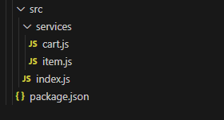

# Shopee Kart (Carrinho de Compras da Shopee)

# Descrição do Projeto

Neste projeto, foi recriado a lógica de um carrinho de compras inspirado na Shopee, utilizando JavaScript e Node.js. 

O sistema permite adicionar, remover, deletar e listar itens, calcular o total da compra, realizar pagamento e interagir com o carrinho por meio de um menu no terminal.

---

## Habilidades utilizadas

O projeto tem o seguinte uso do conhecimento, ferramentas e/ou linguagens abaixo:

- JavaScript (intermediário)
- Node.js (básico)
- Modularização de código
- Lógica de programação (intermediário)

---

## Conhecimentos adquiridos

- Organização de código em módulos (`services`)
- Manipulação de arrays e objetos
- Criação de menus interativos via terminal
- Simulação de operações comerciais (carrinho, pagamento)
- Validação de entrada e controle de fluxo

---

## Funcionalidades Implementadas

-  Adicionar item ao carrinho  
-  Remover uma unidade de um item  
-  Adicionar uma unidade a um item existente  
-  Deletar item completamente  
-  Exibir todos os itens do carrinho  
-  Calcular o total da compra  
-  Finalizar pagamento (com limpeza do carrinho)  
-  Mensagem de "carrinho vazio" quando apropriado -  Menu interativo com opções numeradas  

---

## Estrutura de Arquivos





---

## Exemplos de Uso

```bash
node src/index.js 
📋 Menu de opções:
1️⃣ Adicionar item ao carrinho
2️⃣ Remover 1 unidade de um item
3️⃣ Deletar item completamente
4️⃣ Exibir carrinho
5️⃣ Calcular total
6️⃣ Adicionar 1 unidade a um item existente
7️⃣ Finalizar pagamento
8️⃣ Sair                      
```
